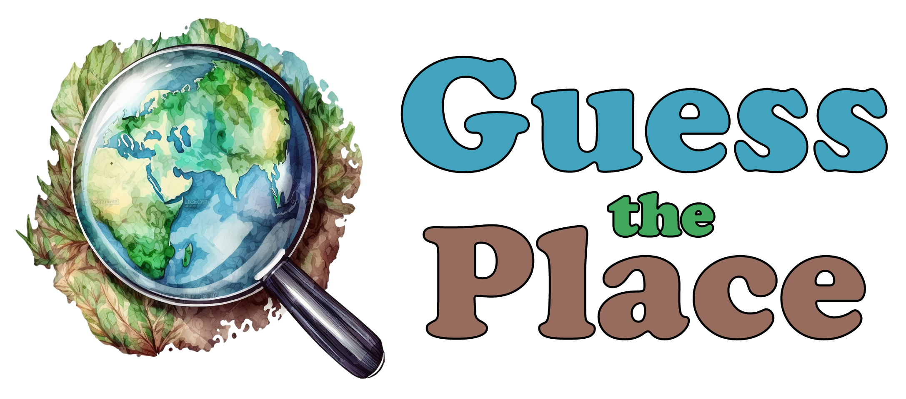

Università degli Studi di Urbino - Informatica e Innovazione Digitale

Studente: Tommaso Mangialardi - Matricola n° 337880

## Informazioni generali

Guess the Place è un gioco ispirato a Geoguessr. Il meccanismo di gioco consiste nel visualizzare l'immagine di un luogo nel mondo e collocarlo sulla mappa, avvicinandosi il più possibile alla posizione reale.

## Compatibilità

Guess the Place è pensato per Android e Windows. La funzionalità sulle altre piattaforme supportate da Flutter non è stata testata, tuttavia i pacchetti utilizzati per l'implementazione delle varie funzionalità sono stati selezionati in modo da essere compatibili con tutte le piattaforme supportate da Flutter, di conseguenza è ragionevole pensare che il programma sia in grado di funzionare con aggiustamenti minimi anche su iOS, MacOS, Linux e web.

## Modalità di gioco

Sono previste due diverse modalità di gioco.
- La prima è una modalità con account è possibile creare direttamente nell'app un account minimale composto da username e password. Gli account vengono memorizzati su un database remoto, con la password protetta da una cifratura SHA-1. Nella modalità con account è possibile giocare partite composte da 5 match, che equivalgono ad altrettante località geografiche di cui indovinare la posizione. Il punteggio più alto degli account registrati viene mostrato in una leaderboard.
- La seconda modalità di gioco è una modalità arcade, che non prevede la creazione di un account ma richiede l'inserimento di un nickname per salvare i match giocati in una cronologia temporanea, anch'essa salvata su database remoto. In questo caso è possibile giocare un numero illimitato di match, tuttavia questi non fanno parte di una partita e non permettono di partecipare alla leaderboard, che è riservata agli utenti registrati.

## Come si gioca

In ogni match si ha a disposizione l'immagine di un luogo nel mondo e una mappa su cui individuarne la localizzazione. L'immagine mostrata viene individuata tramite un sorteggio di valori casuali di latitudine e longitudine. Non è previsto nessun filtro sulle coordinate geografiche, pertanto è possibile che vengano sorteggiate anche immagini in aree oceaniche. Il gioco è indipendente dai servizi Google. Nello specifico le immagini sono fornite da Mapillary e le mappe da OpenStreetMap. Questo aggiunge un ulteriore livello di complessità. Le mappe di OpenStreetMap, infatti, presentano i nomi di Paesi e città nelle lingue ufficiali delle varie nazioni. Mapillary, inoltre, è una piattaforma di immagini caricate dalla community di utenti. Di conseguenza molte immagini disponibili non sono sferiche ma solo a 180° o addirittura statiche, e non sempre è disponibile la funzionalità di navigazione. Inoltre non è raro che si presentino match con particolari difficoltà, tra cui:
- immagini a bassa risoluzione e/o molto sfocate
- immagini notturne in condizioni di parziale o totale oscurità
- immagini scattate a bordo di imbarcazioni o dall'oblò di un aereo
- immagini scattate all'interno di case o altri edifici

Per capire la collocazione geografica di un'immagine, in base alla tipologia di foto di un match, è possibile basarsi su aspetti come nomi di città sui segnali stradali, lingue e domini web nelle pubblicità, marche e modelli dei veicoli, aspetto generale degli edifici, flora e fauna. Una volta individuata una posizione questa deve essere marcata sulla mappa e poi confermata. Il punteggio massimo di un match è di 5000 punti. In dettaglio il metodo di assegnazione del punteggio, basato sulla distanza in linea d'aria tra le coordinate geografiche selezionate e quelle reali, è il seguente:
- entro i 100km di distanza: 5000 punti
- tra i 101 e i 5100km: viene sottratto un punto per ogni km dal punteggio massimo di 5000 punti
- da 5101km in su: 0 punti

È importante notare come a causa del funzionamento tecnico delle piattaforme utilizzate la posizione da individuare spesso non è la posizione esatta dell'immagine visualizzata, ma è il centro di un quadrato con un lato di 0,5° di latitudine per 0,5° di longitudine all'interno del quale si trova l'immagine visualizzata. Questo non impedisce di totalizzare il punteggio massimo, se si riesce ad individuare con sufficiente accuratezza la località geografica.

## Aspetti implementativi

Il database utilizzato per la gestione degli utenti e dello storico delle partite è quello offerto da [Baserow](https://baserow.io/). È un database relazionale accessibile tramite web API, che pertanto simula il funzionamento di un back-end. Nel piano gratuito permette il salvataggio di 3000 record complessivi, per limitare il consumo nella cronologia vengono salvate solo le ultime 100 partite con eliminazione automatica dei record più vecchi. Questo permette di risevare più spazio per la creazione di account.

La piattaforma che fornisce le immagini delle località geografiche è [Mapillary](https://www.mapillary.com). L'ottenimento di un immagine da mostrare avviene interrogando un'API a cui viene fornito come parametro una bounding box di coordinate geografiche con un centro casuale. Il risultato restituito, quando presente, è una serie di codici identificativi di immagini. Tali immagini devono poi essere mostrate in app permettendo la navigazione al loro interno ma senza nessuna necessità di salvataggio delle interazioni da parte dell'utente, pertanto la loro visualizzazione è gestita con la libreria cross-platform [flutter_inappwebview](https://pub.dev/packages/flutter_inappwebview) che permette la visualizzazione all'interno dell'app di una pagina web embedded.

Le mappe open source sono fornite da [OpenStreetMaps](https://www.openstreetmap.org). Per la loro visualizzazione, che richiede il salvataggio delle coordinate selezionate dall'utente, viene utilizzata la libreria cross-platform [flutter_map](https://pub.dev/packages/flutter_map), abbinata a [latlong2](https://pub.dev/packages/latlong2) per la gestione semplificata delle coordinate geografiche e del calcolo della distanza.

L'aspetto grafico dell'applicazione è stato pensato in modo tale da essere neutro e non legato al design language di un sistema operativo specifico. Per questo motivo i componenti grafici utilizzati sono quelli messi a disposizione dall [Moon Design System](https://flutter.moon.io/) con la libreria [moon_design](https://pub.dev/packages/moon_design). Questo ha permesso di dare al programma un aspetto moderno ed elastico.

La gestione dello stato è stata effettuata con la libreria [flutter_riverpod](https://pub.dev/packages/flutter_riverpod), in modo da poter visualizzare, elaborare ed aggiornare i vari elementi che compongono lo stato dell'applicazione in modo elastico, efficiente e indipendente.

### Altre librerie utilizzate

- [markdown_widget](https://pub.dev/packages/markdown_widget) per il rendering della pagina About, il cui contenuto è gestito tramite l'uso di un documento in markdown
- [http](https://pub.dev/packages/http) per gestire le numerose chiamate HTTP che l'applicazione necessita di fare alle API di Baserow e di Mapillary
- [json_serializable](https://pub.dev/packages/json_serializable), [json_annotation](https://pub.dev/packages/json_annotation) e [build_runner](https://pub.dev/packages/build_runner) per la generazione automatica del codice necessario all'elaborazione dei documenti JSON resituiti in output dalle API di Baserow e Mapilary
- [crypto](https://pub.dev/packages/crypto) per la gestione della cifratura SHA-1 che viene applicata alle password degli utenti registrati
- [intl](https://pub.dev/packages/intl) per la visualizzazione delle date dei match effettuati nel corretto fuso orario all'interno della pagina History

## Screenshots

Homepage con il tema scuro                                      |  Homepage con il tema chiaro                                     |  Accesso in modalità con account                                 |  Accesso in modalità arcade
:--------------------------------------------------------------:|:----------------------------------------------------------------:|:----------------------------------------------------------------:|:----------------------------------------------------------------:
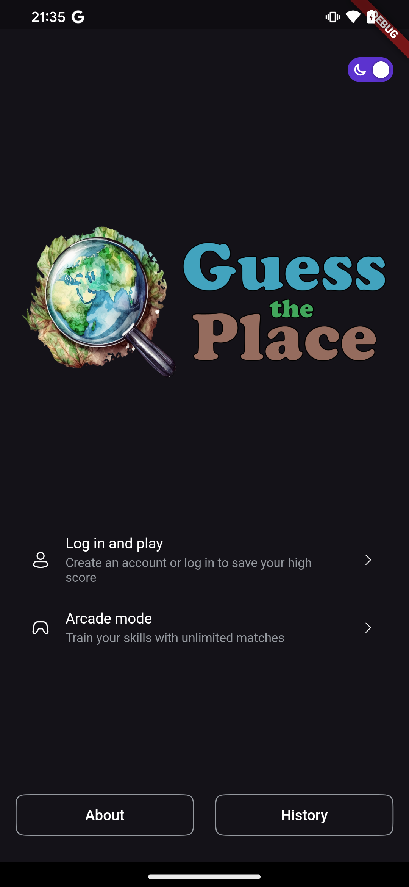  |  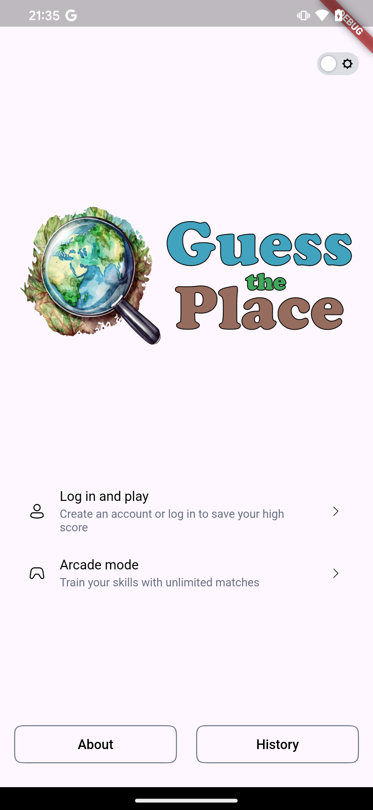|  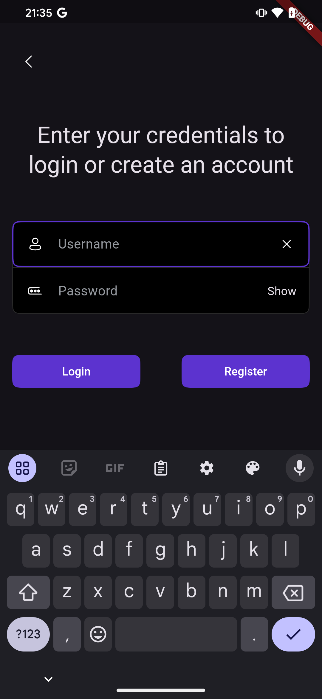     |  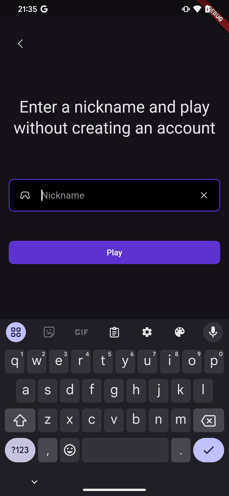

Schermata di benvenuto post-login                               |  Schermata di gioco match                                        |  Risultato match                                                 |  Menù di uscita gioco
:--------------------------------------------------------------:|:----------------------------------------------------------------:|:----------------------------------------------------------------:|:----------------------------------------------------------------:
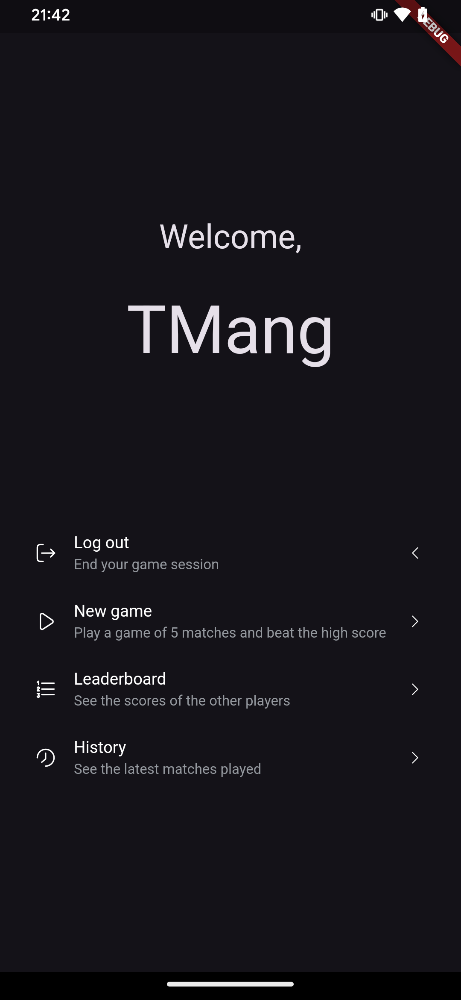 |  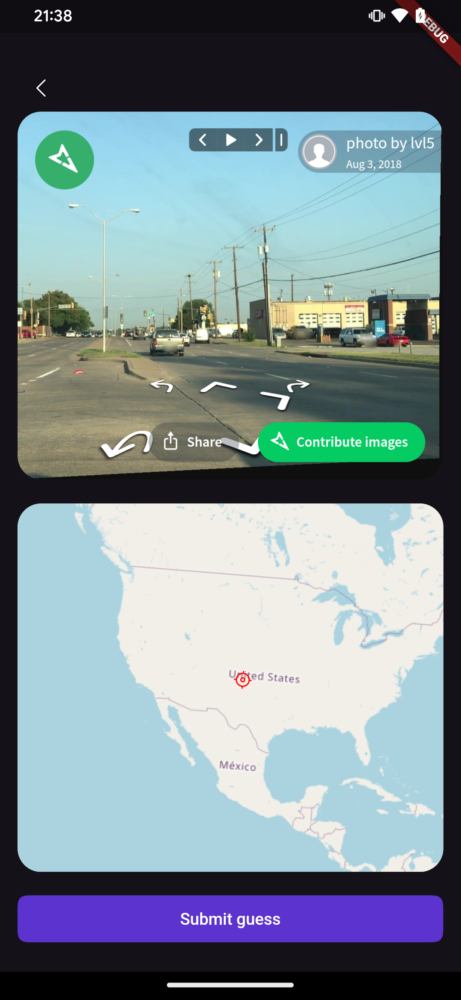     |  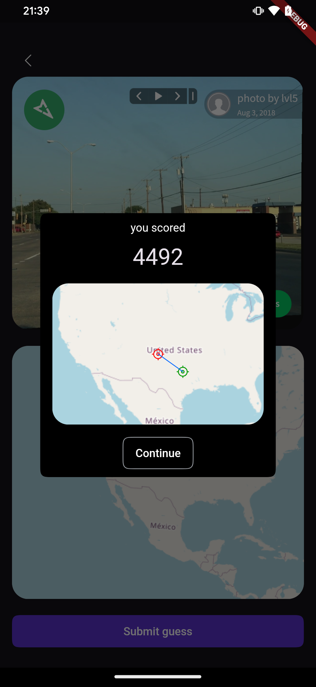              |  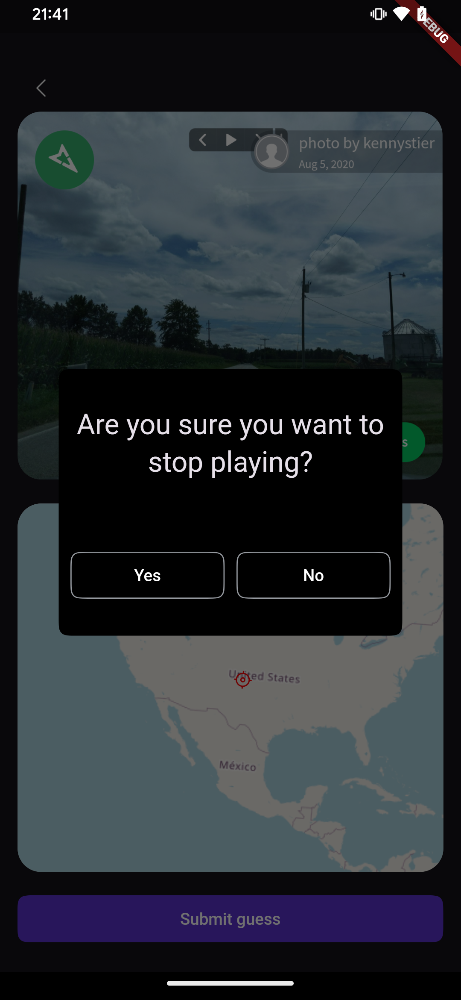

Punteggio post-partita                                          |  Cronologia match                                                |  Leaderboard                                                     |  Credenziali errate
:--------------------------------------------------------------:|:----------------------------------------------------------------:|:----------------------------------------------------------------:|:----------------------------------------------------------------:
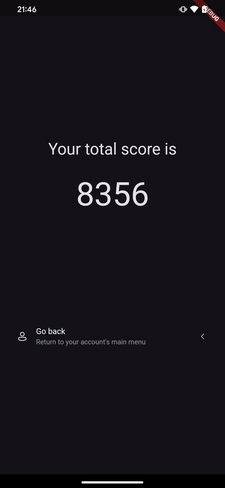         |  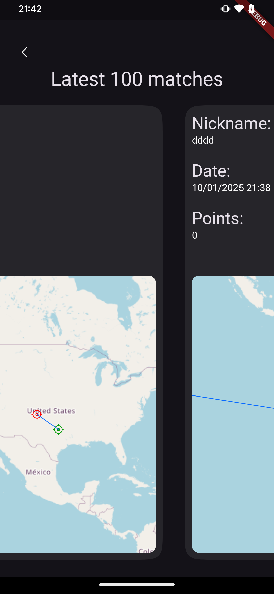                  |  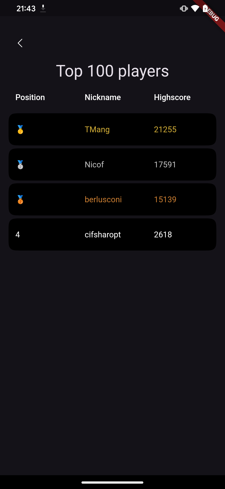                   |  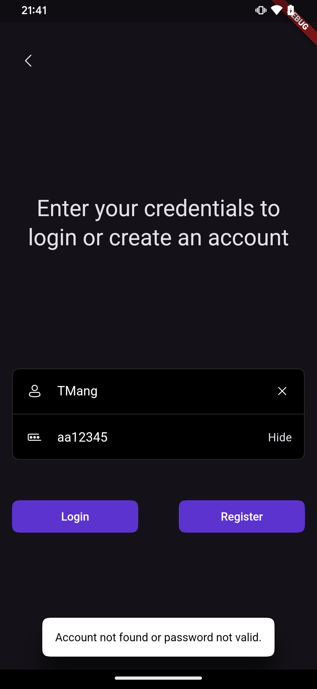

Schermata di gioco match (Windows)
:-----------------------------------------------------------------------------------------------------------------------------------------------------------------------------------------------------------------------------------------------------------------------:
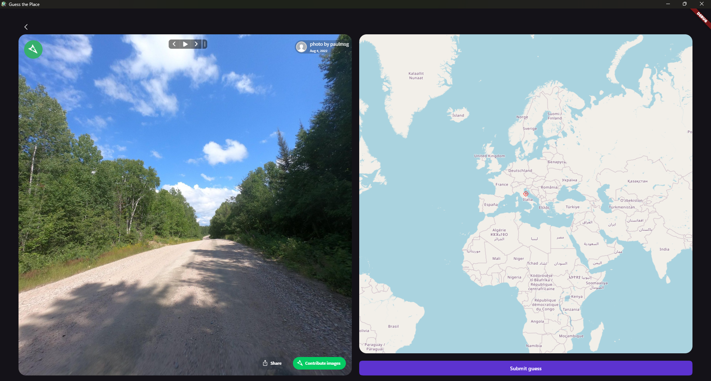
